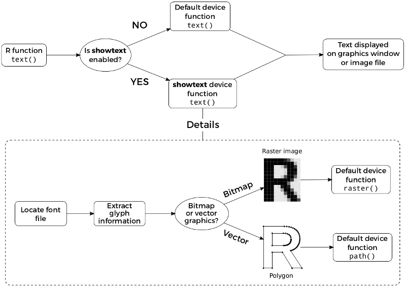

```{r setup, include=FALSE}
if(capabilities("cairo"))
    knitr::opts_chunk$set(dev.args = list(type = "cairo"))
```

## Introduction

In many cases, using non-standard fonts in R graphs is not an easy task,
especially for PDF devices. For example, creating PDF graphs with Chinese
characters may take a lot of extra work. Also, R users may have installed
various fonts in their systems, but for many graphics devices there is no
direct and portable way to make use of those fonts.

The [extrafont](https://github.com/wch/extrafont) package developed by
[Winston Chang](https://github.com/wch) is one nice solution to this problem,
which mainly focuses on using TrueType fonts (`.ttf`) in PDF graphics device.

Now a new solution, the **showtext** package, is able to support more font
formats and more graphics devices, and avoids using external software such as
Ghostscript. **showtext** makes it even easier to use
various types of fonts (TrueType, OpenType, Type 1, web fonts, etc.) in R graphs. 

## A Quick Example

Below is a quick example to show the functionality of the **showtext** package.

```{r message = FALSE, fig.align='center', fig.showtext=TRUE}
library(showtext)
## Loading Google fonts (https://fonts.google.com/)
font_add_google("Gochi Hand", "gochi")
font_add_google("Schoolbell", "bell")

## Automatically use showtext to render text
showtext_auto()

set.seed(123)
hist(rnorm(1000), breaks = 30, col = "steelblue", border = "white",
     main = "", xlab = "", ylab = "")
title("Histogram of Normal Random Numbers", family = "bell", cex.main = 2)
title(ylab = "Frequency", family = "gochi", cex.lab = 2)
text(2, 70, "N = 1000", family = "bell", cex = 2.5)
```

In this example we first load fonts that are available online
through [Google Fonts](https://fonts.google.com/), and then tell R
to render text using **showtext** by calling the `showtext_auto()`
function. All the remaining part is exactly the same as the usual plotting
commands.

This example should work on most graphics devices, including `pdf()`,
`png()`, `postscript()`, and on-screen devices such as `windows()` on
Windows and `x11()` on Linux.

## The Usage

To create a graph using **showtext**, you simply do the following:

- (\*) Load the font
- Open the graphics device
- (\*) Claim that you want to use **showtext** to render the text
- Plot
- Close the device

Only the steps marked with (\*) are new. If you want to use
**showtext** globally, you can call the function `showtext_auto()`
once, and then all the devices after that will automatically use
**showtext** to render text, as the example in the beginning shows.

If you want to have finer control on which part of the code should use
**showtext**, functions `showtext_begin()` and `showtext_end()` will help.
Only plotting functions enclosed by this pair of calls will use **showtext**,
and others not. For example, to change the title font only, we can do:

```r
library(showtext)
font_add_google("Schoolbell", "bell")

set.seed(123)
hist(rnorm(1000), breaks = 30, col = "steelblue", border = "white",
     main = "Histogram of Normal Random Numbers", xlab = "", ylab = "Frequency")

showtext_begin()
text(2, 70, "N = 1000", family = "bell", cex = 2.5)
showtext_end()
```

```{r echo=FALSE, message=FALSE, fig.align='center', fig.showtext=TRUE}
showtext_end()

set.seed(123)
hist(rnorm(1000), breaks = 30, col = "steelblue", border = "white",
     main = "Histogram of Normal Random Numbers", xlab = "", ylab = "Frequency")

showtext_begin()
text(2, 70, "N = 1000", family = "bell", cex = 2.5)
showtext_end()

showtext_begin()
```

## Loading Fonts

Loading font is actually done by package **sysfonts**.

The easy way to load font into **showtext** is by calling

```r
font_add(family = "<family_name>", regular = "/path/to/font/file")
```

where `family` is the name that you assign to that font (so that later you can
call `par(family = "<family_name>")` to use this font in plotting),
and `regular` is the path to the font file.
That is to say, only knowing the "font name" is not sufficient to identify the
font, since the names are usually system dependent. On the contrary, font file
is the entity that actually provides the character glyphs.

Usually the font files are located in some "standard" directories in the system 
(for example on Windows it is typically `C:\Windows\Fonts`).
You can use `font_paths()` to check the current search path or add a new one,
and use `font_files()` to list available font files in the search path.

Below is an example to load system fonts on Windows:

```r
library(showtext)

## HeiTi font for Chinese characters
font_add("heiti", "simhei.ttf")
## Constantia font with regular and italic font faces
font_add("constan", regular = "constan.ttf", italic = "constani.ttf")

showtext_auto()

library(ggplot2)
p = ggplot(NULL, aes(x = 1, y = 1)) + ylim(0.8, 1.2) +
    theme(axis.title = element_blank(), axis.ticks = element_blank(),
          axis.text = element_blank()) +
    annotate("text", 1, 1.1, family = "heiti", size = 15,
             label = "\u4F60\u597D\uFF0C\u4E16\u754C") +
    annotate("text", 1, 0.9, label = 'Chinese for "Hello, world!"',
             family = "constan", fontface = "italic", size = 12)

## On-screen device
x11()
print(p)

## PNG device
ggsave("load_fonts.png", width = 7, height = 4, dpi = 96)

## turn off if no longer needed
showtext_auto(FALSE)
```

<div align="center">
  
</div>

For other OS, you may not have the `simhei.ttf` font file, but there is no
difficulty in using the alternatives. At present `font_add()` supports TrueType
fonts (`.ttf`/`.ttc`) and OpenType fonts (`.otf`), and adding new
font type is trivial as long as FreeType supports it.

Also, there are many free fonts available and accessible on the web, for instance
the Google Fonts project ([https://fonts.google.com/](https://fonts.google.com/)).
**sysfonts** provides an interface to automatically download and register those fonts
through the function `font_add_google()`, as the example below shows.

## Working with R Markdown

**showtext** can work with Rmarkdown/knitr nicely if you take care of the following
two points:

1. Add a `fig.showtext = TRUE` option to the block where you use **showtext** for graphs.
2. Add a `fig_retina = 1` option to the document header if you use HTML output. Without
this option you may see figures with very small fonts.

Below is a minimal example of using **showtext** in Rmarkdown:

``````
---
output:
    html_document:
        fig_retina: 1
---

```{r fig.showtext=TRUE}`r ''`
library(showtext)
font_add_google("Lobster", "lobster")
showtext_auto()


plot(1, pch = 16, cex = 3)
text(1, 1.1, "A fancy dot", family = "lobster", col = "steelblue", cex = 3)
```
``````

## CJK Fonts

**showtext** includes an open source CJK (Chinese, Japanese, and Korean) font
[WenQuanYi Micro Hei](http://wenq.org/wqy2/index.cgi?MicroHei%28en%29).
If you just want to show CJK text in your graph, simply specify the `wqy-microhei`
family name in plotting functions.

Another option is to install the
[Source Han Sans](https://github.com/adobe-fonts/source-han-sans)/[Serif](https://github.com/adobe-fonts/source-han-serif)
fonts locally using the following code:

```r
library(showtext)
font_install(source_han_serif())
font_families()
[1] "sans"                "serif"               "mono"                "wqy-microhei"       
[5] "source-han-serif-cn"
```

See `?font_install` and `?source_han` for more details.

<div align="center">
  
</div>

## How showtext Works

**showtext** renders text by converting it into color-filled polygonal outlines
(for vector graphics) or raster images (for bitmap and on-screen graphics).
Therefore, the rendered text has the same appearance under all platforms.
People who view the graph do not need to install the font that creates the graph.
Of course as a price, the actual text information is lost in this procedure.

The idea above can be better explained by the diagram below.

<div align="center">
  
</div>

A more detailed introduction to the **showtext** package can be found in the
[R Journal article](https://journal.r-project.org/archive/2015-1/qiu.pdf).

## Compatibility with RStudio

Previously **showtext** did not work well with the RStudio graphics device (RStudioGD),
but starting from version 0.9, this issue has been fixed. Simply call `showtext_auto()`
in the RStudio session and then the plots will be displayed correctly.
